# مخططات النظام - نظام إدارة الطرود والشحن

## 📊 فهرس المخططات

1. [مخطط هيكل النظام العام](#مخطط-هيكل-النظام-العام)
2. [مخطط قاعدة البيانات](#مخطط-قاعدة-البيانات)
3. [مخطط تدفق العمليات](#مخطط-تدفق-العمليات)
4. [مخطط API Architecture](#مخطط-api-architecture)
5. [مخطط نظام المصادقة](#مخطط-نظام-المصادقة)
6. [مخطط دورة حياة الطرد](#مخطط-دورة-حياة-الطرد)
7. [مخطط نظام التخويل](#مخطط-نظام-التخويل)
8. [مخطط لوحة الإدارة](#مخطط-لوحة-الإدارة)

---

## مخطط هيكل النظام العام

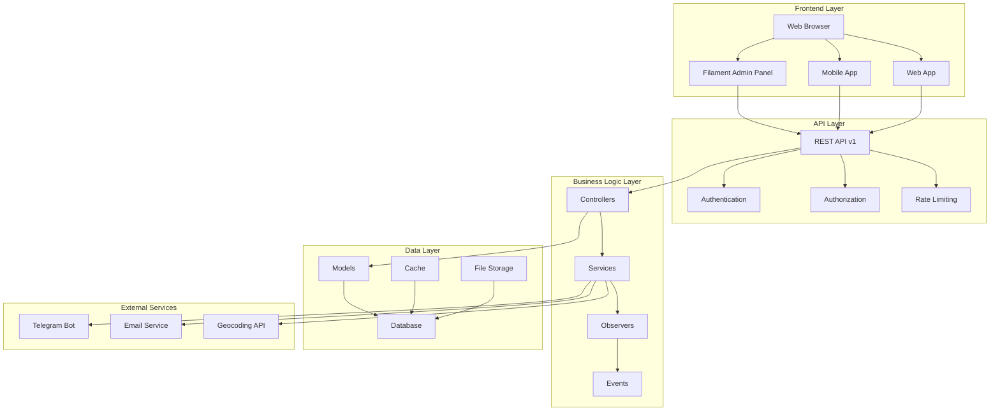

---

## مخطط قاعدة البيانات

```mermaid
erDiagram
    USERS ||--o{ PARCELS : creates
    USERS ||--o{ PARCEL_AUTHORIZATIONS : creates
    USERS ||--o{ APPOINTMENTS : books
    USERS ||--o{ RATES : gives
    USERS ||--o{ PARCEL_HISTORIES : tracks
    USERS ||--|| EMPLOYEES : becomes
    
    CITIES ||--o{ USERS : contains
    CITIES ||--o{ BRANCHES : contains
    CITIES ||--o{ GUEST_USERS : contains
    CITIES }o--|| COUNTRIES : belongs_to
    
    BRANCHES ||--o{ BRANCH_ROUTES : from
    BRANCHES ||--o{ BRANCH_ROUTES : to
    BRANCHES ||--o{ EMPLOYEES : employs
    BRANCHES ||--o{ APPOINTMENTS : hosts
    BRANCHES ||--o{ RATES : receives
    
    BRANCH_ROUTES ||--o{ PARCELS : carries
    BRANCH_ROUTES ||--o{ BRANCH_ROUTE_DAYS : scheduled_on
    BRANCH_ROUTES ||--o{ SHIPMENTS : uses
    
    PARCELS ||--o{ PARCEL_HISTORIES : has
    PARCELS ||--o{ PARCEL_AUTHORIZATIONS : has
    PARCELS ||--o{ RATES : receives
    PARCELS ||--|| APPOINTMENTS : scheduled_for
    PARCELS ||--o{ PARCEL_SHIPMENT_ASSIGNMENTS : assigned_to
    
    GUEST_USERS ||--o{ PARCELS : creates
    GUEST_USERS ||--o{ PARCEL_AUTHORIZATIONS : authorized_for
    
    EMPLOYEES ||--o{ TRUCKS : drives
    EMPLOYEES ||--o{ PARCEL_SHIPMENT_ASSIGNMENTS : confirms_pickup
    EMPLOYEES ||--o{ PARCEL_SHIPMENT_ASSIGNMENTS : confirms_delivery
    
    TRUCKS ||--o{ BRANCH_ROUTE_DAYS : assigned_to
    TRUCKS ||--o{ SHIPMENTS : carries
    
    SHIPMENTS ||--o{ PARCEL_SHIPMENT_ASSIGNMENTS : contains
    
    USERS {
        int id PK
        string first_name
        string last_name
        string email UK
        string user_name UK
        string password
        string phone UK
        string address
        string national_number UK
        date birthday
        timestamp email_verified_at
        int city_id FK
        string image_profile
        timestamps
    }
    
    PARCELS {
        int id PK
        int sender_id FK
        enum sender_type
        int route_id FK
        string reciver_name
        string reciver_address
        string reciver_phone
        decimal weight
        decimal cost
        tinyint is_paid
        enum parcel_status
        string tracking_number UK
        int appointment_id FK
        timestamps
    }
    
    BRANCHES {
        int id PK
        string branch_name
        int city_id FK
        string address
        string phone
        string email
        decimal latitude
        decimal longitude
        tinyint status
        timestamps
    }
```

---

## مخطط تدفق العمليات

### عملية إنشاء طرد جديد

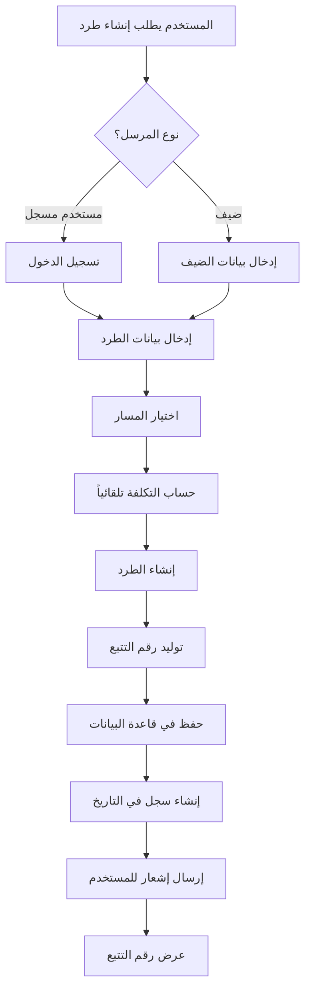

### عملية التخويل

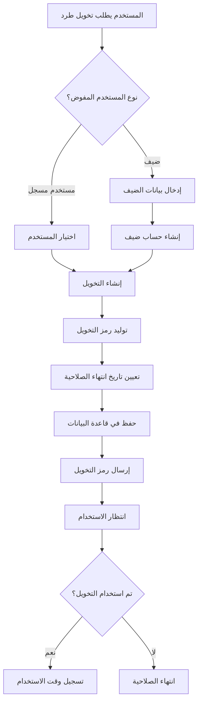

---

## مخطط API Architecture

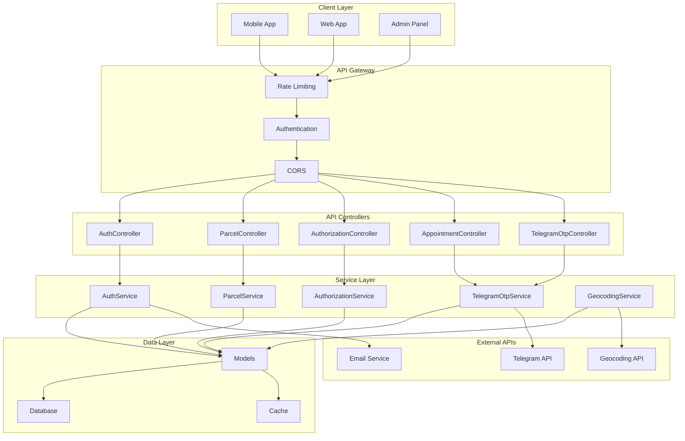

---

## مخطط نظام المصادقة

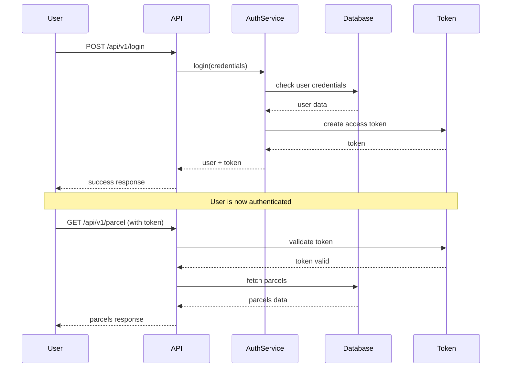

---

## مخطط دورة حياة الطرد

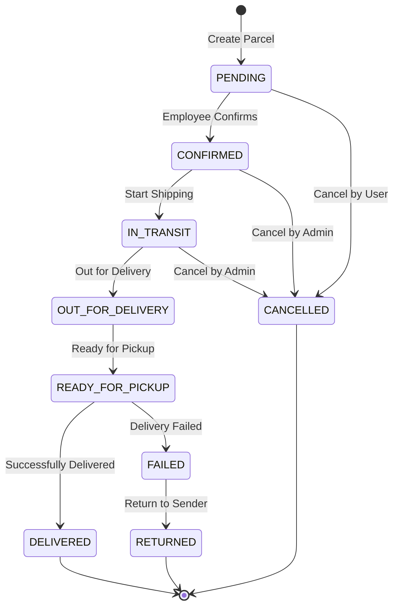

---

## مخطط نظام التخويل

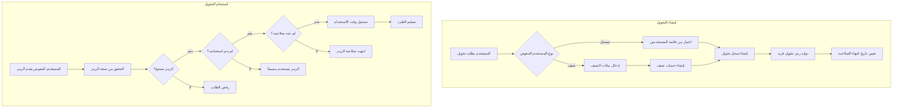

---

## مخطط لوحة الإدارة

```mermaid
graph TB
    subgraph "Filament Admin Panel"
        A[Dashboard] --> B[Parcels Management]
        A --> C[Users Management]
        A --> D[Branches Management]
        A --> E[Employees Management]
        A --> F[Appointments Management]
        A --> G[Authorizations Management]
        A --> H[Reports & Analytics]
    end
    
    subgraph "Parcels Management"
        B --> B1[Create Parcel]
        B --> B2[Edit Parcel]
        B --> B3[View Parcel Details]
        B --> B4[Track Parcel Status]
        B --> B5[Delete Parcel]
    end
    
    subgraph "Users Management"
        C --> C1[Create User]
        C --> C2[Edit User]
        C --> C3[View User Profile]
        C --> C4[Manage Permissions]
        C --> C5[User Restrictions]
    end
    
    subgraph "Branches Management"
        D --> D1[Create Branch]
        D --> D2[Edit Branch]
        D --> D3[Manage Routes]
        D --> D4[Location Services]
        D --> D5[Branch Analytics]
    end
    
    subgraph "Reports & Analytics"
        H --> H1[Parcel Statistics]
        H --> H2[User Analytics]
        H --> H3[Revenue Reports]
        H --> H4[Performance Metrics]
        H --> H5[Export Data]
    end
```

---

## مخطط نظام الإشعارات

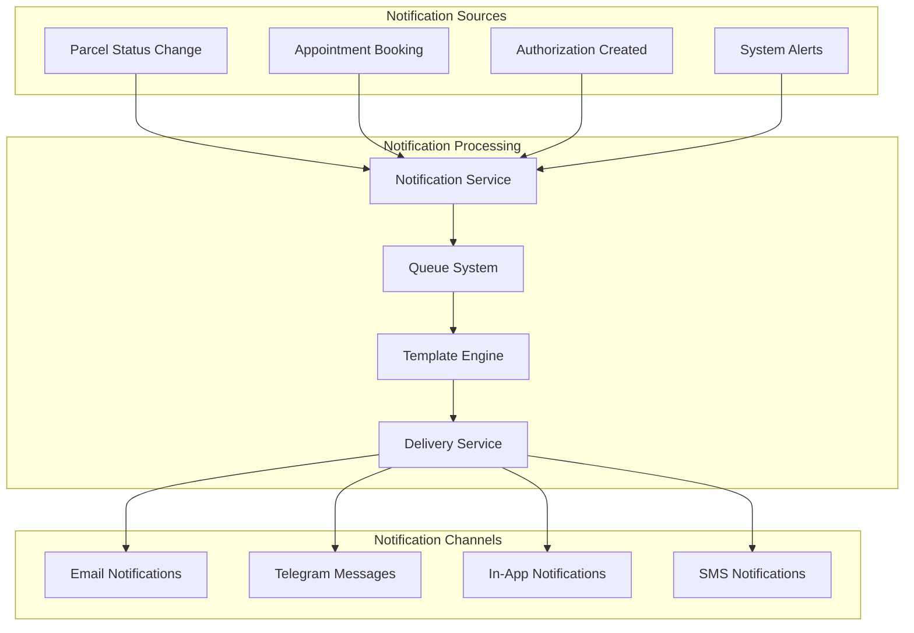

---

## مخطط الأمان والحماية

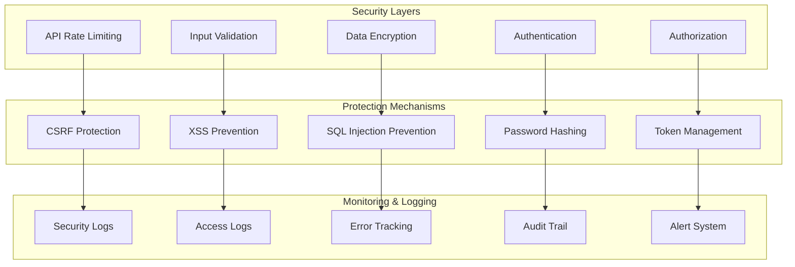

---

## مخطط التكامل مع الخدمات الخارجية

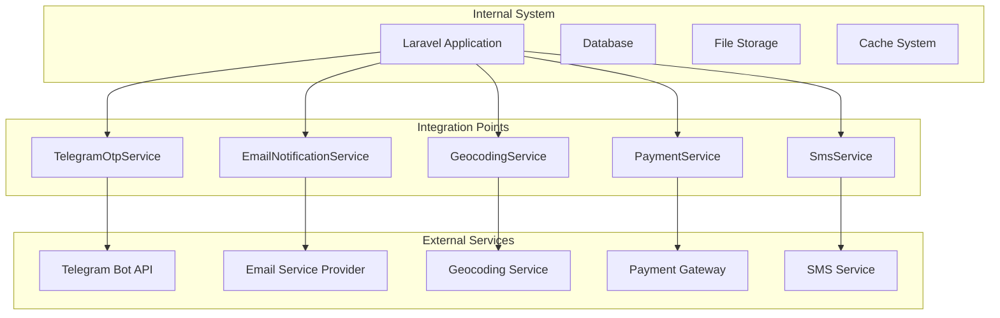

---

**هذه المخططات توفر رؤية شاملة لهيكل النظام وتدفق العمليات والتفاعلات بين المكونات المختلفة.**
